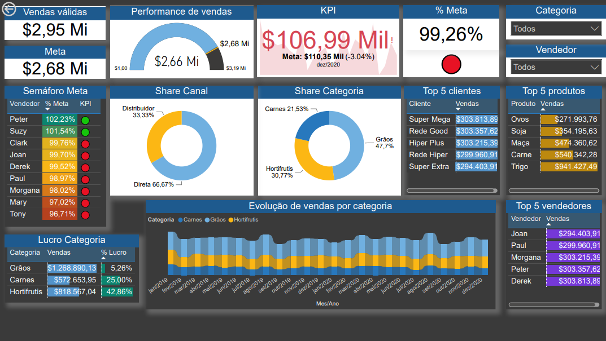
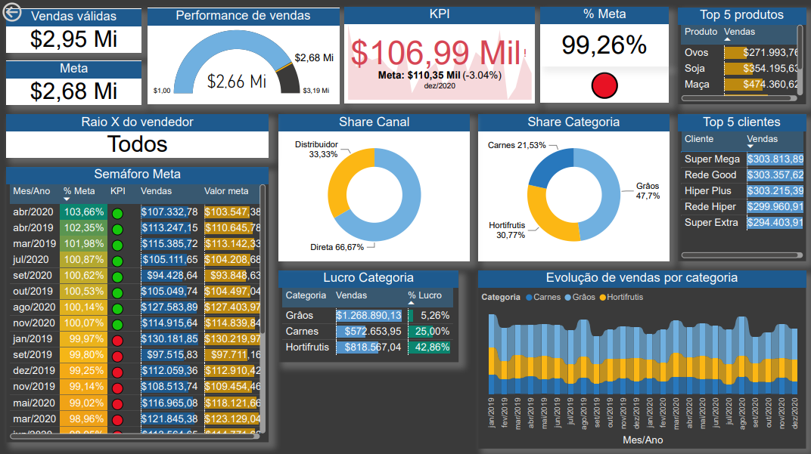

# Projeto Vendas
Painel criado para fornecer uma visão rápida e clara do desempenho das vendas, permitindo que os gestores e equipe de vendas acompanhem o progresso e identifiquem tendências, oportunidades e desafios.

## Visual

- **Performance de vendas** com base no valor de meta estabelicido
- **Indicador chave (KPI)**: com base nas vendas por mês/ano, tendo como destino a meta estabelecida, assim podendo averiguar o percentual de defícit ou lucro
- **Tabela de semáforo** para os vendedores permitindo visualizar quais vendedores atingiram suas metas
- **Top 5 clientes** por números de vendas
- **Top 5 produtos** por números de vendas
- **Top 5 vendedores** por números de vendas
- **Porcentagem de lucro** para cada **categoria de produtos**
- **Percentual de vendas** por **canal** de distribuição
- **Percentual de vendas** por **categoria** de produtos
- **Evolução de vendas** por mês/ano de cada categoria através do **gráfico de faixas** que permite observar não só os valores de cada mês, mas também a variação percentual

## Filtros
- Filtrar por categoria
- Filtrar por vendedores
- **Filtro dill-through**: navegar para página 2 visualizando todos os gráficos filtrados por vendedor

